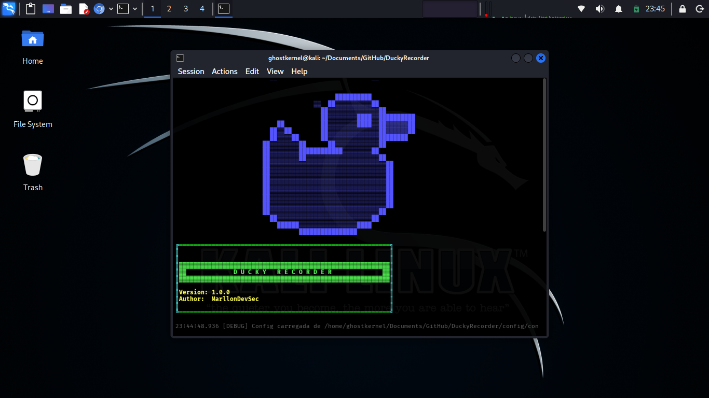

# 🦆 DuckyRecorder v1.0.0



DuckyRecorder é uma ferramenta CLI para gravação de eventos HID (teclado e mouse) e exportação das interações em formatos compatíveis com dispositivos USB HID, como Rubber Ducky e placas baseadas em ATmega32u4.

> ⚠️ Uso restrito a ambientes autorizados, testes de segurança com permissão explícita e automação legítima.

---

## ✨ Funcionalidades

* 🎙️ **Gravação em tempo real** – Captura eventos de teclado e mouse com timestamps precisos
* ⏯️ **Controle inteligente** – Pausa/continuação com teclas configuráveis (F9/F10 padrão)
* 👁️ **Visualização ao vivo** – Exibe eventos capturados em tempo real durante a gravação
* 💾 **Armazenamento estruturado** – Salva gravações em formato JSON com metadados
* 📤 **Exportação multiplataforma** – Converte para:

  * Rubber Ducky (`.ducky.txt`)
  * Arduino HID (`.ino`) com suporte a `Keyboard.h` e `Mouse.h`
* 🌍 **Internacionalização** – Suporte a Português e Inglês
* 🎨 **Interface CLI rica** – Cores, banners adaptativos e menus interativos
* ⚙️ **Configuração persistente** – Configurações salvas automaticamente em JSON
* 🔧 **Sistema de logs** – Logs detalhados para debugging e monitoramento
* 🖱️ **Controle de mouse preciso** – Movimento relativo, cliques e zeramento inicial

---

## 📁 Estrutura do Projeto

```text
DuckyRecorder/
├── DuckyRecorder/
│   ├── cli/
│   ├── core/
│   │   ├── colors.py
│   │   ├── events.py
│   │   ├── hotkeys.py
│   │   ├── language.py
│   │   ├── recorder.py
│   │   └── timeline.py
│   ├── exporters/
│   │   ├── ducky.py
│   │   └── arduino.py
│   ├── utils/
│   │   ├── console.py
│   │   └── logger.py
│   ├── config/
│   ├── lang/
│   ├── __init__.py
│   ├── main.py
│   └── __main__.py
├── config/
├── recordings/
├── exports/
├── logs/
├── docs/
│   └── menu.png
├── requirements.txt
├── LICENSE
└── README.md
```

---

## 🛠️ Instalação

### Pré-requisitos

* Python 3.8+
* pip

### Passo a passo

```bash
git clone https://github.com/seu-usuario/DuckyRecorder.git
cd DuckyRecorder
pip install -r requirements.txt
```

### Dependências

* `pynput>=1.7.6`
* `colorama>=0.4.6`

---

## ▶️ Como Usar

### Execução

```bash
python -m DuckyRecorder
# ou
python DuckyRecorder/main.py
```

### Fluxo típico

1. Iniciar gravação
2. Executar ações (digitação, cliques, etc.)
3. Parar gravação (F10 por padrão)
4. Exportar para o formato desejado
5. Utilizar o arquivo exportado em ambiente autorizado

---

## 📦 Formatos de Exportação

### 1️ Rubber Ducky (`.ducky.txt`)

* Converte texto para `STRING`
* Preserva `DELAY`
* Agrupa caracteres consecutivos
* Comenta eventos não suportados

### 2️ Arduino HID (`.ino`)

Compatível com:

* Arduino Leonardo
* Arduino Micro
* Pro Micro
* ATmega32u4

Recursos:

* `Keyboard.print()` para texto
* `Keyboard.press()` / `Keyboard.release()` para teclas especiais
* `Mouse.move()` com segmentação automática
* Cliques esquerdo, direito e meio
* Zeramento inicial opcional do cursor

---

## ⚙️ Configuração

Arquivo: `config/config.json`

```json
{
  "language": "pt",
  "mouse_speed": "FAST",
  "zero_mouse_on_start": true,
  "auto_save": true,
  "pause_key": "F9",
  "stop_key": "F10",
  "default_recording_name": "",
  "show_live_preview": true,
  "max_events_display": 10
}
```

---

## 🔐 Uso Ético

Esta ferramenta deve ser utilizada exclusivamente para:

* Ambientes próprios
* Testes autorizados
* Pesquisa e estudo
* Automação legítima
* Acessibilidade

O uso indevido pode violar legislações locais e políticas institucionais.

---

## 🐛 Logs

* Logs em tempo real no menu
* Arquivos persistentes em `logs/`
* Níveis: DEBUG, INFO, WARNING, ERROR
* Rotação automática (até 1000 mensagens em memória)

---

## 🧠 Roadmap Futuro

* Replay local automático
* Filtros avançados de eventos
* Editor visual de timeline
* Plugins de exportação
* API REST
* Suporte a mais idiomas

---

## 📄 Licença

MIT License

Copyright (c) 2026 MarllonDevSec

---

## 🤝 Contribuições

1. Fork
2. Criar branch
3. Commit
4. Push
5. Pull Request

---

## 🏗️ Arquitetura

### Recorder

Responsável pelos listeners e captura de eventos.

### Timeline

Gerencia sequência temporal e normalização de eventos.

### Exporters

Transformam eventos para formatos específicos.

### Language Manager

Carregamento dinâmico de idiomas.

### Config Manager

Persistência e merge automático de configurações.
